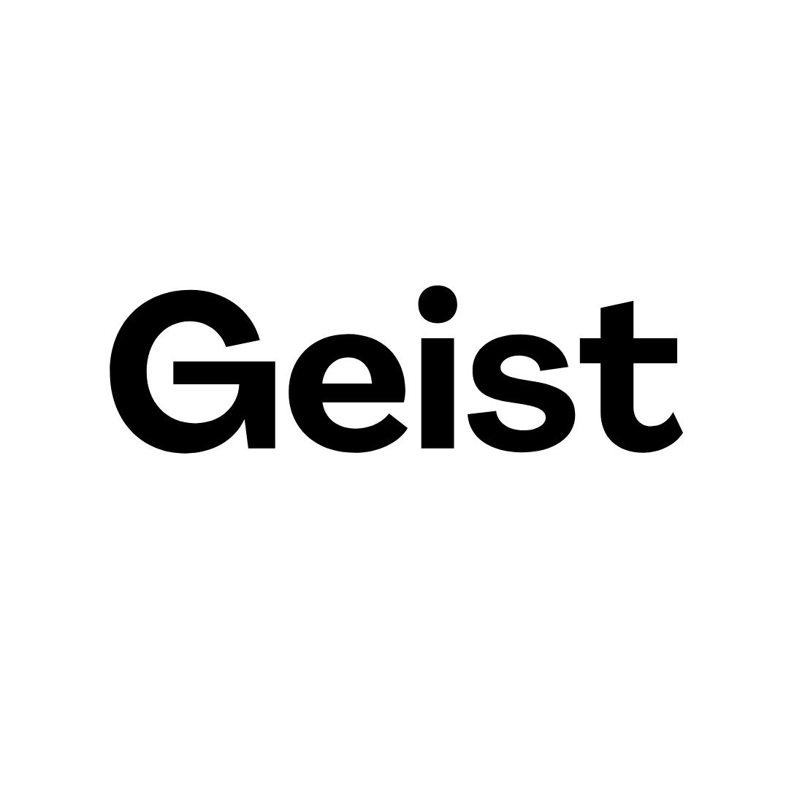

The most widely used, high-performance Minecraft server that aims to fix gameplay and mechanics inconsistencies.


**Support and Project Discussion:**
- [Our forums](https://forums.papermc.io/) or [Discord](https://discord.gg/papermc)

How To (Server Admins)
------
Paperclip is a jar file that you can download and run just like a normal jar file.

Download Paper from our [downloads page](https://papermc.io/downloads/paper).

Run the Paperclip jar directly from your server. Just like old times

* Documentation on using Paper: [docs.papermc.io](https://docs.papermc.io)
* For a sneak peek at upcoming features, [see here](https://github.com/PaperMC/Paper/projects)

How To (Plugin Developers)
------
* See our API patches [here](patches/api)
* See upcoming, pending, and recently added API [here](https://github.com/orgs/PaperMC/projects/2/views/4)
* Paper API javadocs here: [papermc.io/javadocs](https://papermc.io/javadocs/)
#### Repository (for paper-api)
##### Maven

```xml
<repository>
    <id>geist</id>
    <url>https://reposilite.aventox.com/releases</url>
</repository>
```

```xml
<dependency>
    <groupId>com.aventox.geist</groupId>
    <artifactId>geist</artifactId>
    <version>1.21.3-R0.1-SNAPSHOT</version>
    <scope>provided</scope>
</dependency>
```
##### Gradle
```kotlin
repositories {
    maven {
        url = uri("https://reposilite.aventox.com/releases")
    }
}

dependencies {
    compileOnly("com.aventox.geist:geist:1.21.3-R0.1-SNAPSHOT")
}

java {
    toolchain.languageVersion.set(JavaLanguageVersion.of(21))
}
```

How To (Compiling Jar From Source)
------
To compile Paper, you need JDK 21 and an internet connection.

Clone this repo, run `./gradlew applyPatches`, then `./gradlew createMojmapBundlerJar` from your terminal. You can find the compiled jar in the project root's `build/libs` directory.

To get a full list of tasks, run `./gradlew tasks`.

